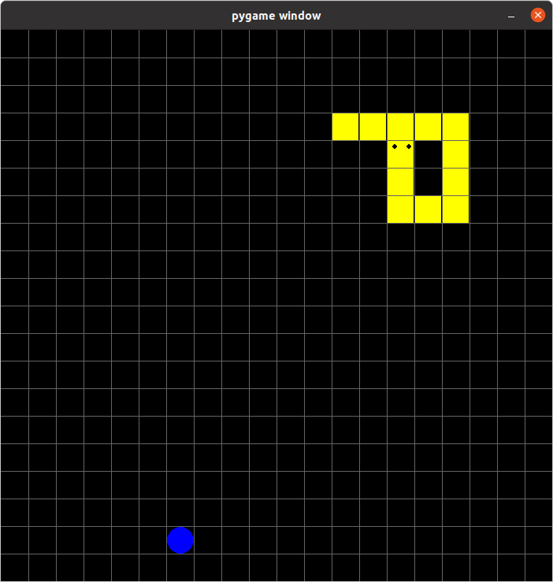

<!-- TABLE OF CONTENTS -->
<details open="open">
  <ol>
    <li><a href="#about-the-project">About The Project</a></li>
    <li><a href="#built-with">Built With</a></li>
    <li><a href="#prerequisites">Prerequisites</a></li>
    <li><a href="#installation">Installation</a></li>
    <li><a href="#usage">Usage</a></li>
    <li><a href="#contact">Contact</a></li>
  </ol>
</details>


<!-- ABOUT THE PROJECT -->
## About The Project
<p align="center">

</p>

Simple Snake game in Python

Description:
* Simple project to learn some Python and PyGame basics

### Built With

* [Python](https://www.python.org/)
* [PyGame](https://www.pygame.org/)

<!-- GETTING STARTED -->
## Getting Started
### Prerequisites

* You will need Python and PyGame
1. Install Python
   ```sh
   sudo apt-get install python3.9 
   ```
2. Install Pip
   ```sh
   sudo apt-get install python3-pip
   ```
3. Install PyGame
   ```sh
   pip install pygame
   ```

### Installation

1. Clone the repo
   ```sh
   git clone https://github.com/PaulMagos/Snake.git
   ```
2. Open directory
   ```sh
   cd Snake
   ```
3. Run
   ```sh
   python3 main.py
   ```

<!-- CONTACT -->
## Contact
[![LinkedIn][linkedin-shield]](https://www.linkedin.com/in/paulmathos/)

<!-- ACKNOWLEDGEMENTS -->
## Acknowledgements
* [JetBrains](https://www.jetbrains.com/)


## A HUGE THANKS TO [othneildrew](https://github.com/othneildrew) FOR THIS [README TEAMPLATE](https://github.com/othneildrew/Best-README-Template)


[linkedin-shield]: https://img.shields.io/badge/-LinkedIn-black.svg?style=for-the-badge&logo=linkedin&colorB=555
